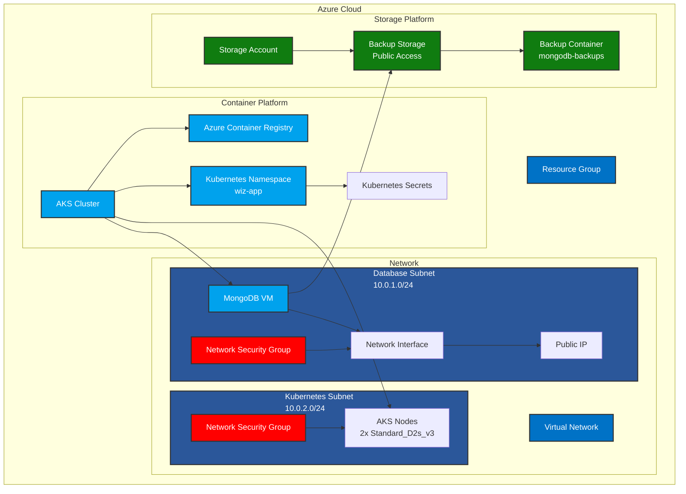

# Wiz Application Deployment Architecture

This document outlines the high-level deployment architecture of the Wiz application in Azure.

## Infrastructure Overview

## Component Details

### Network Layer
- **Virtual Network**: 10.0.0.0/16
  - Database Subnet: 10.0.1.0/24
  - Kubernetes Subnet: 10.0.2.0/24

### Database Layer
- **MongoDB VM**:
  - Size: Standard_B2s
  - OS: Ubuntu 20.04 LTS
  - MongoDB Version: 4.4
  - Authentication: Enabled
  - Backup: Daily at 2:00 AM UTC

### Container Platform
- **AKS Cluster**:
  - Node Count: 2
  - Node Size: Standard_D2s_v3
  - Network Plugin: Azure
  - Network Policy: Azure
  - RBAC: Enabled

- **Azure Container Registry**:
  - SKU: Basic
  - Admin Access: Enabled

### Storage Platform
- **Main Storage Account**:
  - Tier: Standard
  - Replication: LRS

- **Backup Storage**:
  - Public Access: Enabled (for testing)
  - Container: mongodb-backups
  - Retention: 30 days

## Security Notes
- The backup storage is intentionally configured with public access for security testing purposes
- Network Security Groups are configured with permissive rules for testing
- MongoDB authentication is enabled with default credentials (should be changed in production)

## Deployment Flow
1. Resource Group creation
2. Network infrastructure setup
3. MongoDB VM deployment
4. Storage accounts creation
5. AKS cluster deployment
6. Container Registry setup
7. Kubernetes namespace and secrets creation 