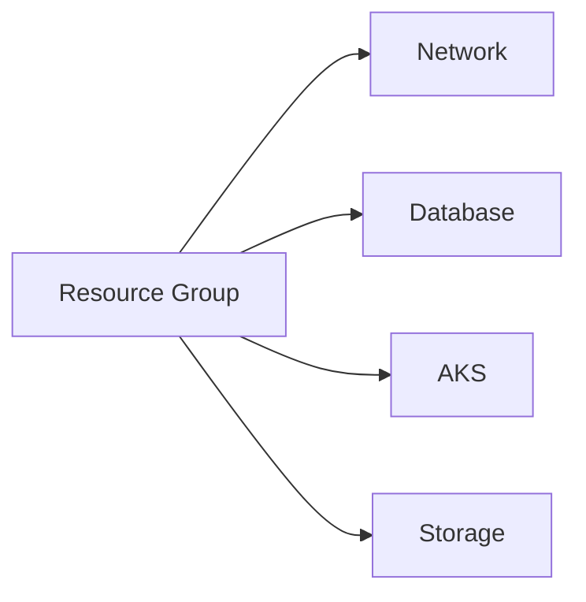

# Simple Architecture Diagram

```mermaid
flowchart LR
    A[Resource Group] --> B[Network]
    A --> C[Database]
    A --> D[AKS]
    A --> E[Storage]
```

## Components
- Network: Virtual Network with subnets
- Database: MongoDB VM
- AKS: Kubernetes Cluster
- Storage: Backup Storage 